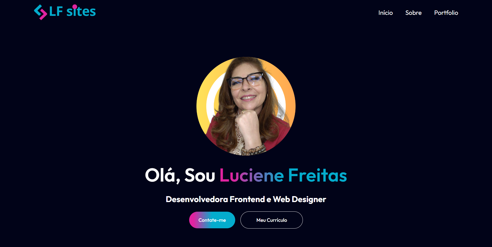

# 🌐Portfólio

🚀 Sobre Minha Experiência
Sou desenvolvedora especializada em criação de sites profissionais, portfólios e lojas virtuais. Utilizo as melhores tecnologias para garantir um design moderno, funcional e que atenda às suas necessidades. Com o foco em transformar ideias em projetos impactantes, ajudo a criar uma presença online marcante!
 

 
<h2 align="left"> 🛠️ Tecnologias Utilizadas </h2>

- **JavaScript** 
- **ReactJS** 
 
 
## 📸 Prévia do Projeto

  

 

[Assista a Prévia do Projeto](https://youtu.be/TCZR78F-kwQ)

 ## ✔️ Autora

- [LucieneFreitas](https://github.com/LucieneFreitas)

